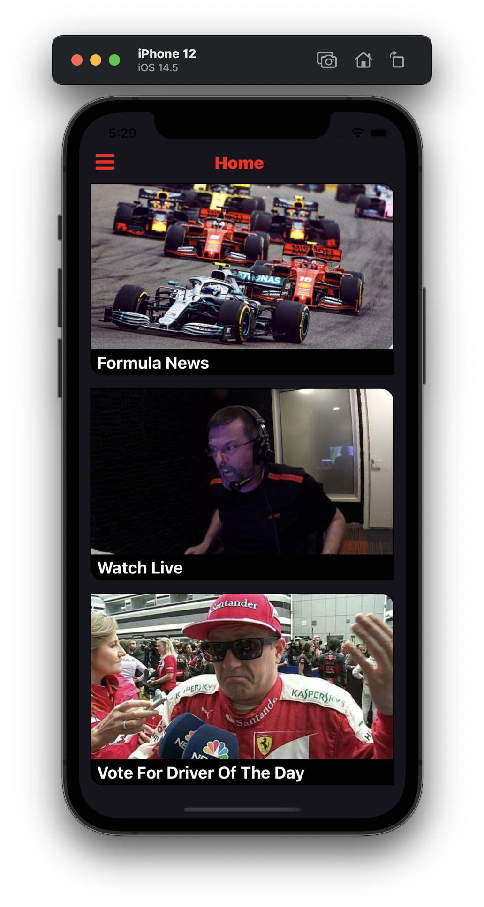
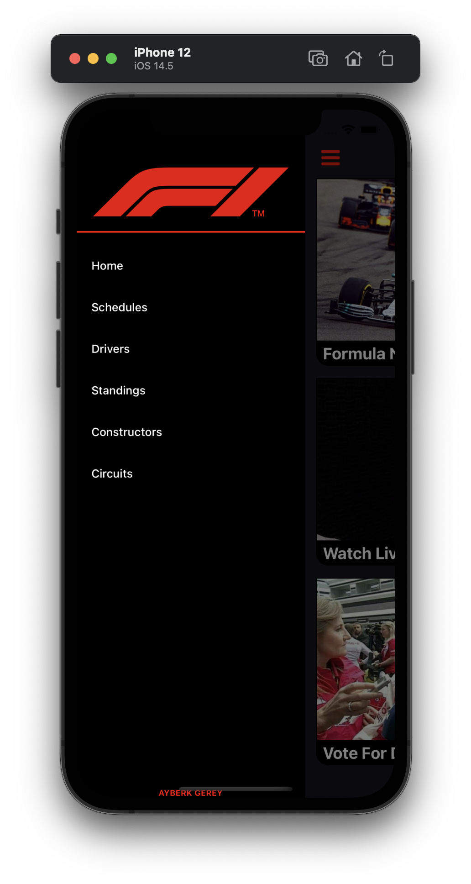
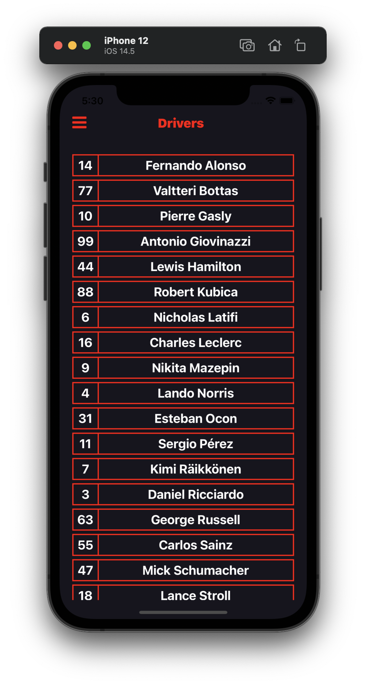

<h1> Formula1_Info_App </h1>
<ul>
<li>Formula 1 Tracking And Information App For My Personal Use.</li>
<li>Useful for searchers and enthusiasts of this sport</li>
<li>Ergast Api Used</li>
<li>Application links to more detailed Wikipedia websites which are belong to api</li>
</ul>
 
<h3>Api</h3>
<li>http://ergast.com/mrd/</li>
 
<h3>Screenshots</h3>

  

 
